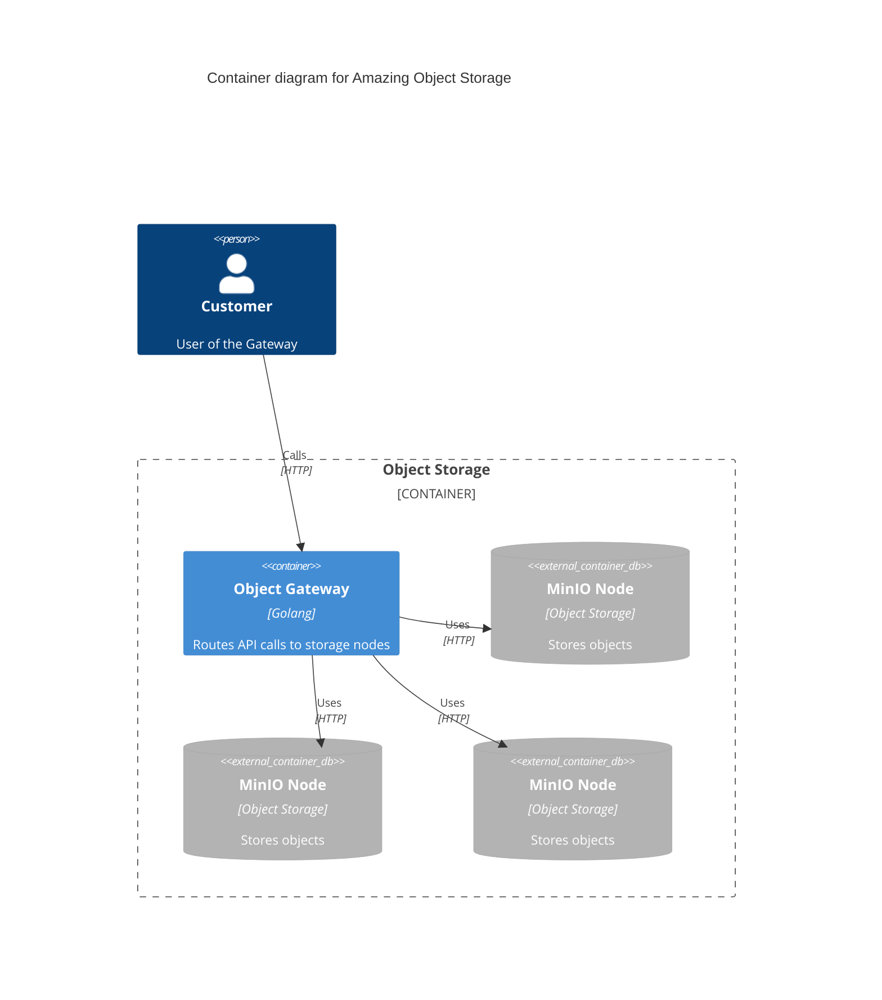
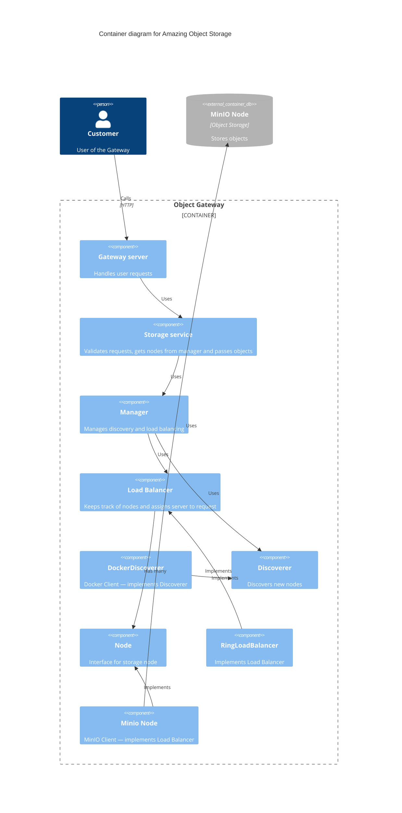

# object-storage
Hey Spacelift team mebers!

I present you my homework assignment for an Amazing Object storage.

## How to run
You can find `Makefile` with useful targets.

As an entry point, you can just do:
```sh
make run
```
Which is pretty much just `docker compose up --build`. App run this way should work out of the box.

### Other targets 
<details open>
<summary>Tests</summary>

- Unit test:
```sh
make test
```
- Integration test (can take a while to init):
```sh
make itest
```
</details>

<details open>
<summary>Tools</summary>

- Tools:
```sh
make tools
```
- Code generation:
```sh
make generate
```
- Format:
```sh
make format
```
- Lint:
```sh
make lint
```
</details>


## High level architecture

<details open>
<summary>Containers</summary>



</details>

<details open>
<summary>Components</summary>



</details>

# Original content
Your starting point is a local Docker daemon with multiple self-contained Minio Object Storage instances.
They can be identified by having amazin-object-storage-node in their container name.
Each of them listens on port 9000.
They have access keys and secret keys configured through Docker using environment variables.
You can assume that the set of Minio instances doesn't change in a "test scenario", though you shouldn't assume any constant number of them existing.

As you're task you'll be creating a simple **stateless** distributed Object Storage Gateway, listening on HTTP port 3000.
As its main functionality it should offer two endpoints:
- **PUT** */object/{id}* - The request body should be used as the object body. If the file already exists, you should either overwrite it, or return an error, your choice.
- **GET** */object/{id}* - Should respond with the object body, or return code 404 if it doesn't exist.

When handling a get or put request, you should consistently (wrt the ID) choose one of the Minio instances and use it to serve the request.
You should use varying Minio instances depending on the ID.

The IDs are alphanumeric, up to 32 characters.

The container your app runs in will have /var/run/docker.sock mounted and will share a docker network with the Minio instances.
Any information about the Minio instances (such as the IP address, or the access/secret keys) should be read dynamically from the local Docker daemon.

You should use the [Docker client library](https://github.com/moby/moby/tree/master/client),
the [Minio client library](https://github.com/minio/minio-go),
as well as any other libraries you may deem necessary or useful (within reason).
i.e. you can use the [Gorrila Mux](https://github.com/gorilla/mux) library as an HTTP router,
but feel free to use a different one or even just the standard library.

You should implement proper error handling. (the app shouldn't instantly crash if something doesn't work)

There's a docker-compose.yml file included you can use as a starting point. The comments there contain some tips.
Feel free to modify the docker-compose.yml file, as well as the Dockerfile, as you see fit.

The project should work out of the box using
```
docker-compose up --build
```

Good luck!
