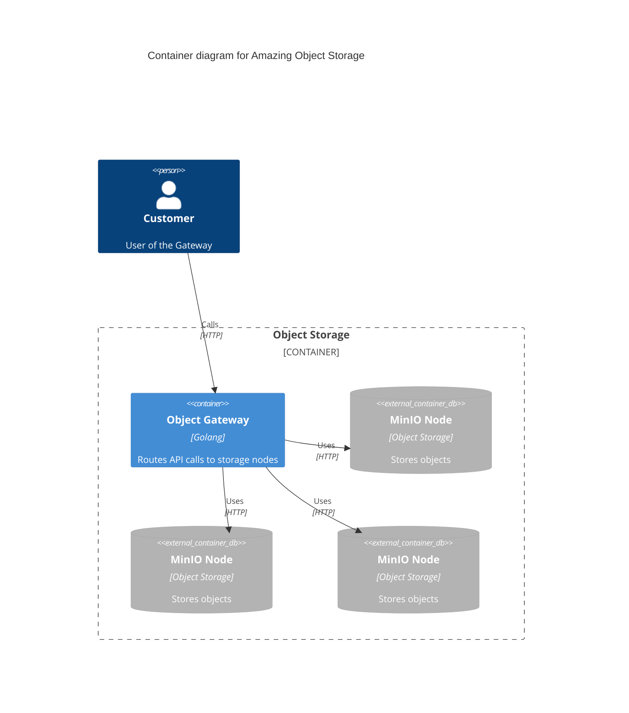
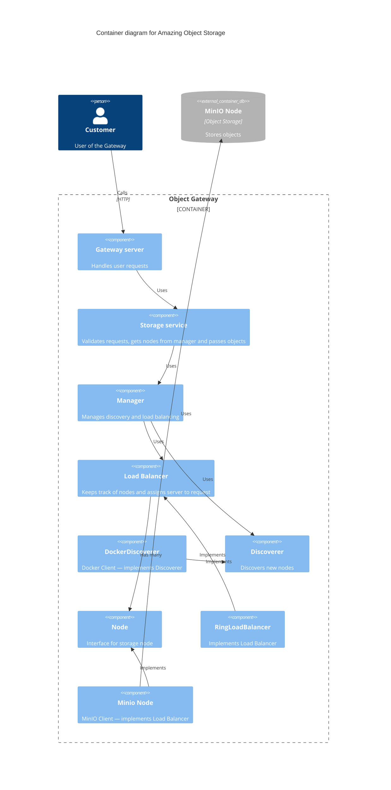

# object-storage
This is a distributed object storage implementation with discovery and load balancing.

## How to run
You can find `Makefile` with useful targets.

As an entry point, you can just do:
```sh
make run
```
Which is pretty much just `docker compose up --build`. App run this way should work out of the box.

### Other targets 
<details open>
<summary>Tests</summary>

- Unit test:
```sh
make test
```
- Integration test (can take a while to init):
```sh
make itest
```
</details>

<details open>
<summary>Tools</summary>

- Tools:
```sh
make tools
```
- Code generation:
```sh
make generate
```
- Format:
```sh
make format
```
- Lint:
```sh
make lint
```
</details>


## High level architecture

<details open>
<summary>Containers</summary>



</details>

<details open>
<summary>Components</summary>



</details>

